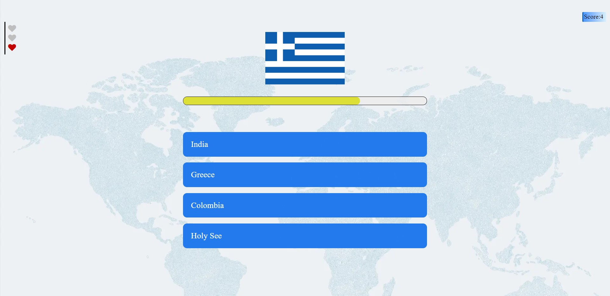
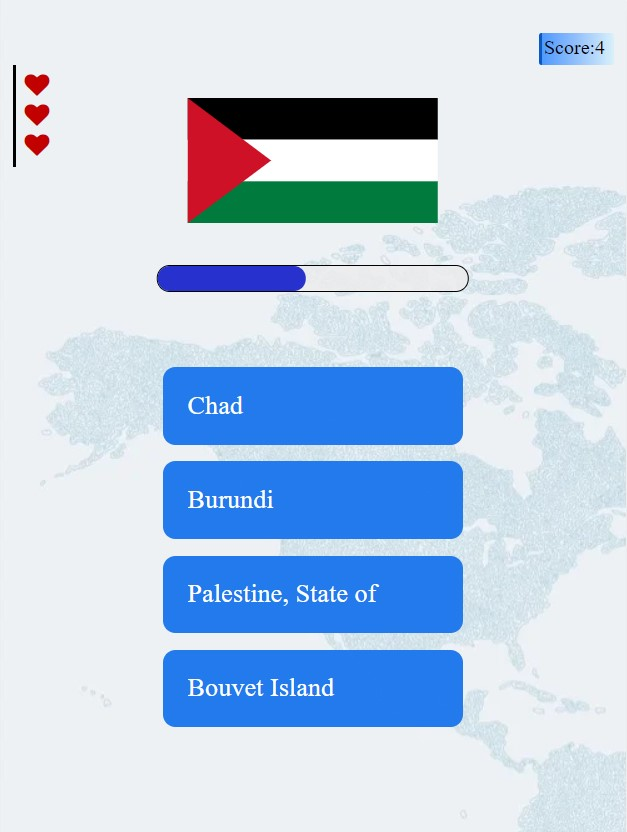

# quiz-project
country flags quiz game with vue.js
## Getting Started
to start this project you need to run it on a live-server. for this you can :
- install live-server using `npm install -g live-server`
- install live-server extention from visual studio store

## Snapshot 
#### Desktop

#### Mobile

## note
For optimal implementation you can use components in vue3.
